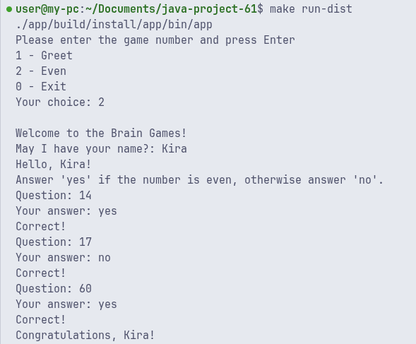
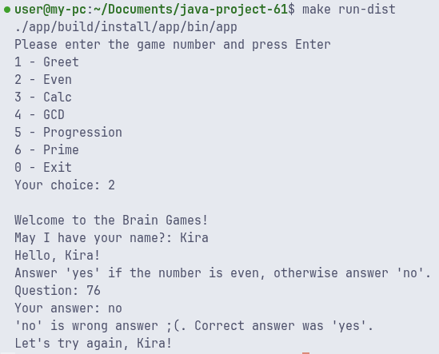
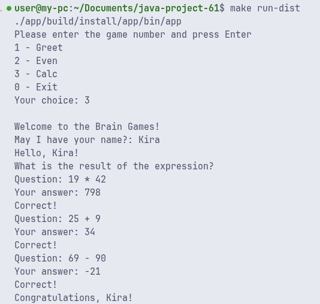
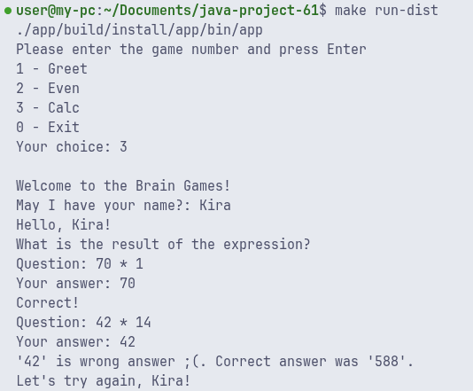
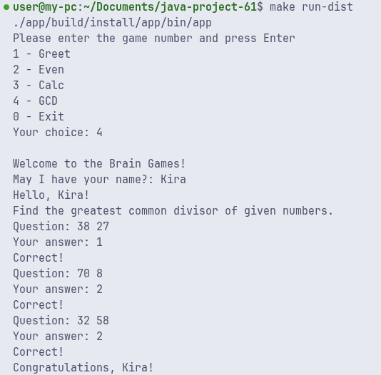
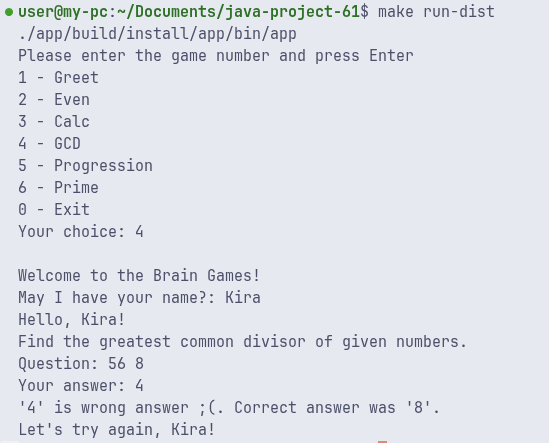
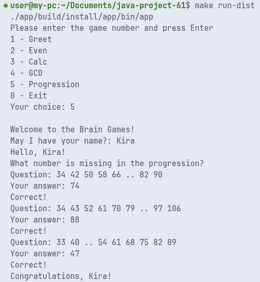
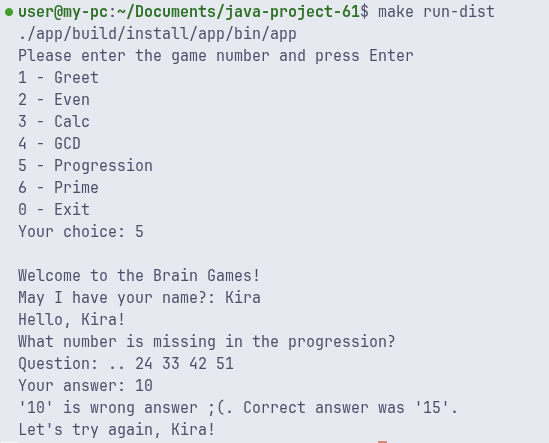
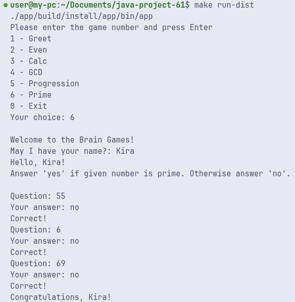
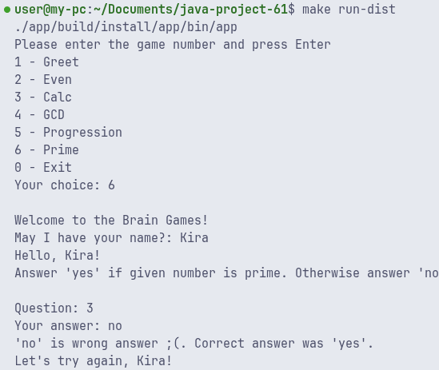

 

## Examples of games

| Title            | Success                                                       | Failure                                                        |
| ---------------- | ------------------------------------------------------------- | -------------------------------------------------------------- |
| Even Game        |                |                |
| Calc game        |            |           |
| GCD game         |                  |                 |
| Progression game |  |  |
| Prime game       |              |              |
